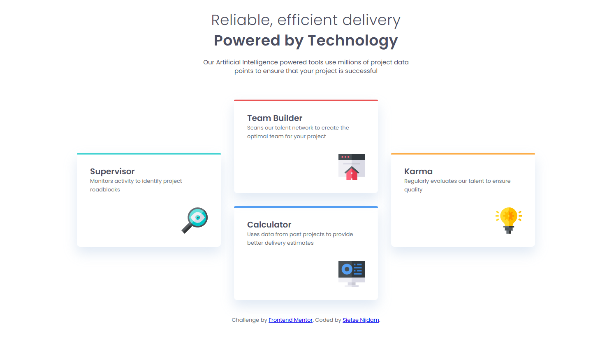

# Frontend Mentor - Four card feature section solution

This is a solution to the [Four card feature section challenge on Frontend Mentor](https://www.frontendmentor.io/challenges/four-card-feature-section-weK1eFYK). Frontend Mentor challenges help you improve your coding skills by building realistic projects. 

## Table of contents

- [Overview](#overview)
  - [The challenge](#the-challenge)
  - [Screenshot](#screenshot)
  - [Links](#links)
- [My process](#my-process)
  - [Built with](#built-with)
  - [What I learned](#what-i-learned)
- [Author](#author)

## Overview

### The challenge

Your challenge is to build out this feature section and get it looking as close to the design as possible.

You can use any tools you like to help you complete the challenge. So if you've got something you'd like to practice, feel free to give it a go.

Your users should:

- View the optimal layout for the site depending on their device's screen size

### Screenshot

### Links

- Live Site URL: [live site here](https://blackwhisky.github.io/Four-card-feature-section/)

## My process

### Built with

- Semantic HTML5 markup
- CSS custom properties
- Flexbox
- CSS Grid
- Mobile-first workflow

### What I learned

With this Challange there was no way around starting to use Gird.
I had to do my fair share of reading and puzzeling to get a understanding of it but now I van see how powerfull it can be in combination with Flexbox.

## Author

- Website - [Sietse Nijdam](https://www.your-site.com) (still in development)
- Frontend Mentor - [@Mythage](https://www.frontendmentor.io/profile/Mythage)
- LinkedIn - [Sietse Nijdam](https://www.linkedin.com/in/sietse-nijdam-41a39596/)

